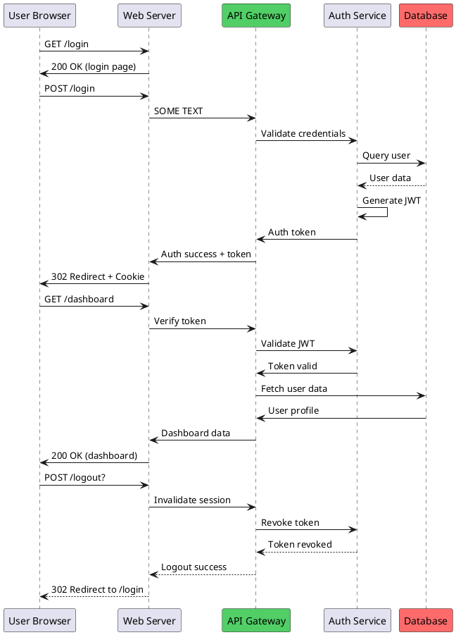
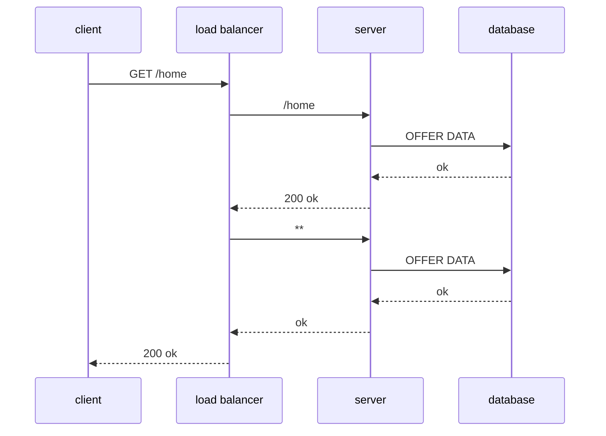

# EDD Project Roadmap


## Feature Ideas

export to / plant / mermaid / text

decision tree diagram graph

more deterministic layouts

quicky annotate the diagram connections - enter in e mode takes you to the next one down in edit mode -

### CRITICAL: Layout & Pathfinding Improvements

**Current Issues:**
- Lines go "all over the place" - pathfinding doesn't choose optimal routes
- No diagram title support
- No centering of diagrams in the editor area
- Unpredictable node placement
- Complex diagrams look messy instead of fantastic

**Required Improvements:**

1. **Diagram Title Support**
   - Add `title` field to diagram metadata
   - Render title at top center of diagram
   - Option to show/hide title

2. **Diagram Centering**
   - Calculate diagram bounds
   - Center within available terminal space
   - Predictable placement every time
   - Option for alignment (center, left, top-left)

3. **Better Pathfinding Algorithm**
   - Current algo creates unnecessary detours
   - **KEY INSIGHT: Exit nodes in the direction of destination**
     - If target is below, exit from bottom (not side then down)
     - If target is right, exit from right side
     - Choose exit port based on target direction, not just any available port
     - This eliminates most unnecessary turns
   - Need smarter cost function that:
     - Minimizes total path length
     - Strongly prefers straight lines (horizontal/vertical)
     - Heavily penalizes unnecessary turns
     - Avoids crossing other paths when possible
     - Routes around nodes more cleanly
   - Consider A* with better heuristics or flow-based routing
   - Path aesthetics matter as much as correctness

   **Example of current issue:**
   - Node A directly above Node B
   - Current: Exit A from side → go left/right → go down → arrive at B (2-3 turns)
   - Correct: Exit A from bottom → go straight down → arrive at B (0 turns)

4. **Layout Engine Improvements**
   - More deterministic node placement
   - Support for layers/stages (left-to-right flow)
   - Respect node grouping hints
   - Better handling of fan-out/fan-in patterns
   - Swimlanes or columns for organized layouts

**Goal:** Diagrams need to look FANTASTIC out of the box
- Professional appearance
- Clean, minimal line crossings
- Predictable, logical layout
- Easy to create AND beautiful to look at
- This is how we'll stand out from other tools

**Priority:** HIGH - Core to the product's value proposition

### Protocol/Format Diagram Type

A new diagram type for documenting wire formats, binary protocols, and nested message structures.

**Use Cases:**
- Network protocol documentation (TCP/IP, HTTP/2, custom RPC protocols)
- Binary format specifications (file formats, packet structures)
- API message structures (REST, gRPC, custom protocols)
- Data serialization formats (Protocol Buffers, MessagePack, etc.)
- Nested data structures with conditional sections

**Key Features:**
- **Nested containers**: Boxes within boxes for layered protocols
- **Field tables**: Show byte layouts with field names, types, and sizes
- **Conditional sections**: IF/ELSE blocks based on message types or flags
- **Data flow arrows**: Show how data flows between protocol layers
- **Inline examples**: Trace actual message examples through the structure
- **Type annotations**: Display field types (4 bytes, string, uint16, etc.)

**Example:**
```
Full Wire Format
┌─────────────────────────────────────────────────────────────────┐
│ FRAME (Transport Layer)                                         │
│ ┌─────────┬───────┬─────────┬───────────┬─────────────────────┐ │
│ │ Length  │ Flags │ MsgType │ StreamID  │ Payload             │ │
│ │ 4 bytes │ 1 byte│ 1 byte  │ 4 bytes   │ Variable            │ │
│ └─────────┴───────┴─────────┴───────────┴─────────────────────┘ │
└─────────────────────────────────────────────────────────────────┘
                                ↓
                   Payload decoded based on MsgType
```

**Implementation Ideas:**
- Diagram type: `"protocol"` or `"format"`
- Special node types: `frame`, `field`, `conditional`, `example`
- Layout engine: Vertical stacking with automatic nesting
- Support for annotations: field sizes, types, descriptions
- Export to markdown tables, Protocol Buffer schemas, etc.

**Text Input Format:**
Quick, intuitive syntax for defining message formats:

```
// Bracket notation: [name:size]
[Length:4][Flags:1][Type:1][StreamID:4][Payload:*]

// Multi-level nesting with indentation
Frame: [Length:4][Type:1][Payload:*]
  Request: [Method:string][Args:*]
    AddRequest: [A:int32][B:int32]
  Response: [Result:*]

// Alternative curly-brace style
frame {
  length:4 flags:1 type:1 stream:4
  payload {
    method:string args:*
  }
}

// Or table format for complex specs
| Field    | Size   | Type   | Description       |
| Length   | 4      | uint32 | Total frame size  |
| Flags    | 1      | bits   | Control flags     |
| Payload  | *      | bytes  | Variable content  |
```

**Size Notation:**
- Numbers: byte count (e.g., `4` = 4 bytes)
- `*`: Variable length
- `string`: Null-terminated or length-prefixed
- Type names: `int32`, `uint16`, `bytes`, etc.

**Priority:** Medium - Would fill a gap that existing diagram tools don't handle well 


### 8. Advanced Features
- **Subgraphs/Clusters**: Group related nodes visually
- **Layers**: Support for multi-layer diagrams
- **Export Formats**: 
  - SVG export
  - PNG export (via terminal screenshot)
  - Mermaid.js conversion
  - GraphViz DOT format
- **Import Formats**:
  - GraphViz DOT files
  - Mermaid.js diagrams
  - PlantUML diagrams

### 9. Developer Experience
- Language Server Protocol (LSP) for JSON diagram files
- Diagram validation and linting
- Auto-layout suggestions
- Refactoring tools (rename nodes, extract subgraph)

## Known Issues to Address
- Bidirectional connections overlap and can be hard to follow
- Very dense diagrams can have overlapping labels
- Large diagrams can be slow to render
- No way to specify preferred routing (e.g., "avoid crossing")

## Future Vision
EDD could become the go-to tool for creating technical diagrams in the terminal, similar to how `tree` is used for directory structures. The focus should remain on simplicity, clarity, and integration with existing terminal workflows.


Example 1



Example 2




