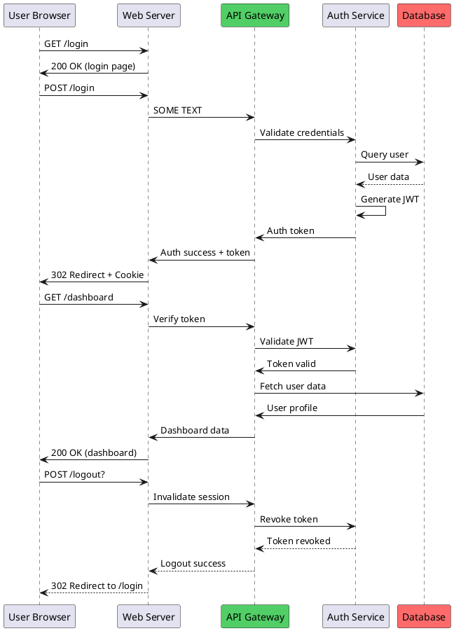
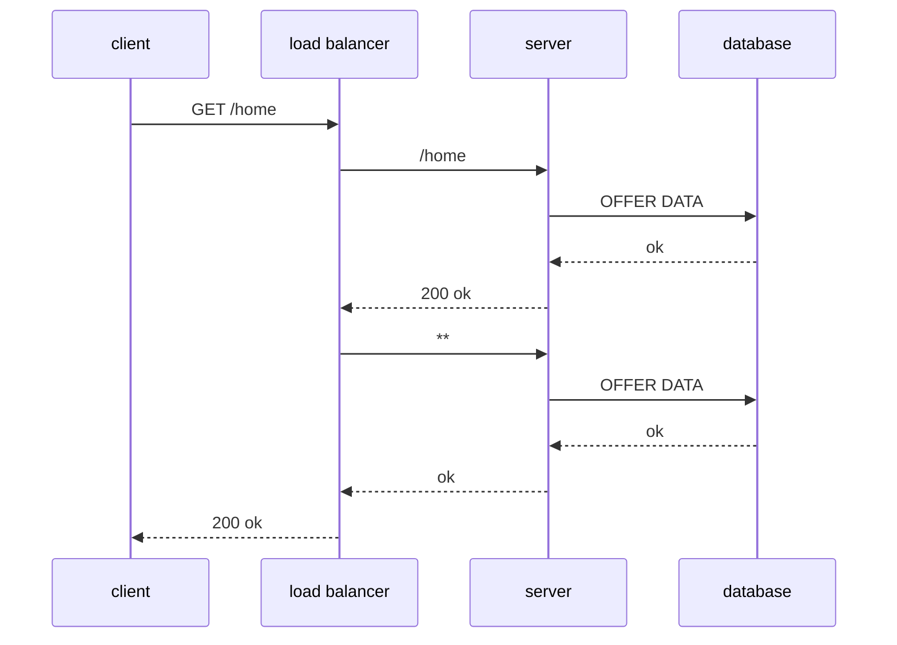

# EDD Project Roadmap

## Feature Ideas

export to / plant / mermaid / text

decision tree diagram graph

more deterministic layouts 

quicky annotate the diagram connections - enter in e mode takes you to the next one down in edit mode - 

### 8. Advanced Features
- **Subgraphs/Clusters**: Group related nodes visually
- **Layers**: Support for multi-layer diagrams
- **Export Formats**: 
  - SVG export
  - PNG export (via terminal screenshot)
  - Mermaid.js conversion
  - GraphViz DOT format
- **Import Formats**:
  - GraphViz DOT files
  - Mermaid.js diagrams
  - PlantUML diagrams

### 9. Developer Experience
- Language Server Protocol (LSP) for JSON diagram files
- Diagram validation and linting
- Auto-layout suggestions
- Refactoring tools (rename nodes, extract subgraph)

## Known Issues to Address
- Bidirectional connections overlap and can be hard to follow
- Very dense diagrams can have overlapping labels
- Large diagrams can be slow to render
- No way to specify preferred routing (e.g., "avoid crossing")

## Future Vision
EDD could become the go-to tool for creating technical diagrams in the terminal, similar to how `tree` is used for directory structures. The focus should remain on simplicity, clarity, and integration with existing terminal workflows.

Example 1

Example 2

